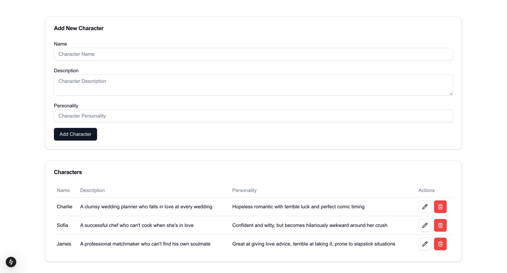
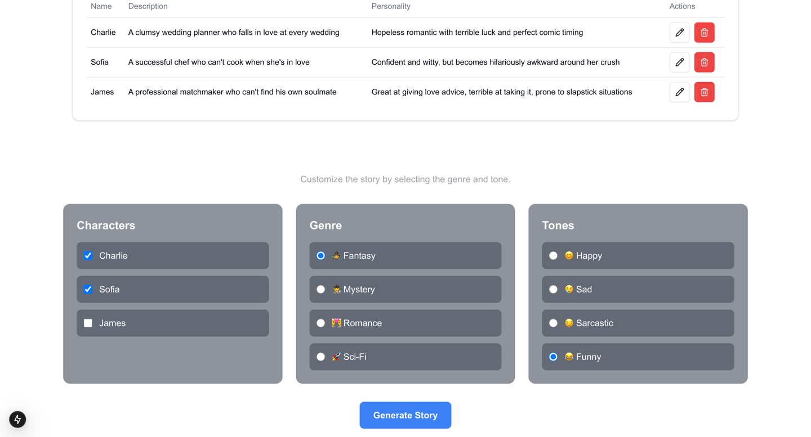
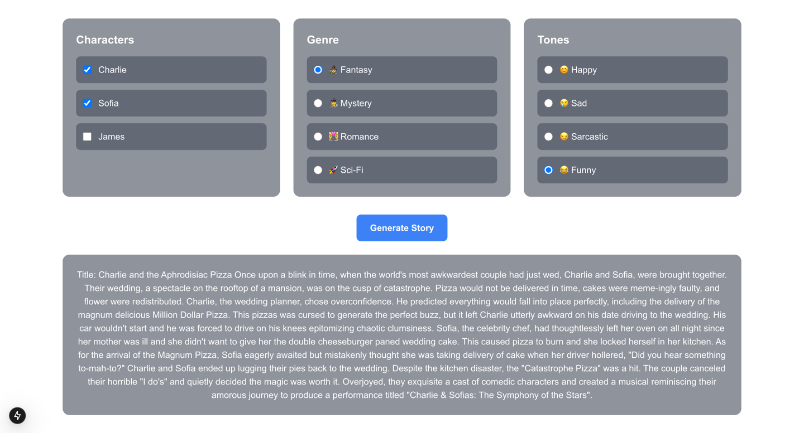

## Week 3 Project - AI GPT Bootcamp Q4 2024 - Encode Club

### Project Description
This is a web application built using Next.js to generate captivating stories using AI. The application allows users to create and manage characters that will be used in the story generation process. Users can add, edit, and delete characters, each with a name, description, and personality.

### Prerequisites
1. **Node.js Installation**
    - Node.js version 18 or later (This project uses Node.js 20)
    - You can download it from [nodejs.org](https://nodejs.org)
    - If you use `nvm` and need to make sure you are using Node.js 20, you can run:
      ```bash
      nvm use 20
      ```
2. **LLM Model Loader**
   - In this project, we used [Text Generation Web UI](https://github.com/oobabooga/text-generation-webui)


### How to Run the Project
Follow these steps to run the project locally:

1. **Clone the Repository**
   ```bash
   git clone https://github.com/ifanzalukhu97/Week-3-Project-AI-GPT-Bootcamp-Q4-2024-Encode-Club.git
   cd Week-3-Project-AI-GPT-Bootcamp-Q4-2024-Encode-Club
   ```

2. **Install Dependencies**
   ```bash
   npm install
   ```

3. **Run LLM Model Loader**
    - Make sure to use the --api flag because we use a local AI API
    - For macOS:
      ```bash
      ./start_macos.sh --api
      ```
    - For Windows:
      ```bash
      ./start_windows.sh --api
      ```
    - For Linux:
      ```bash
      ./start_linux.sh --api
      ```

4. **Start Development Server**
   ```bash
   npm run dev
   ```

5. **Access the Application**
    - Open your browser and navigate to [http://localhost:3000](http://localhost:3000)
    - The application should now be running and ready to use


### Overview / Report



